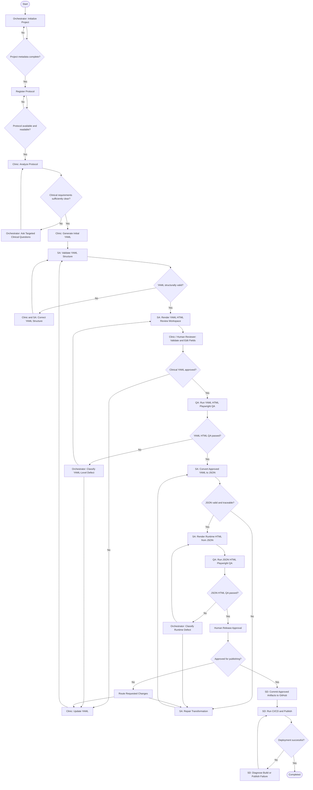
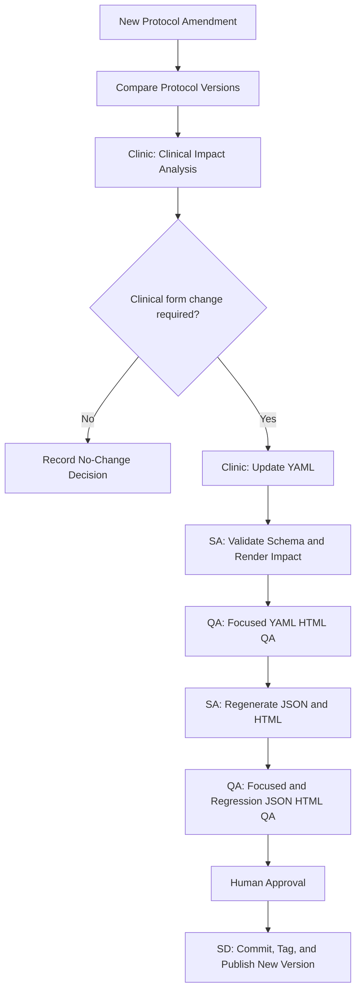
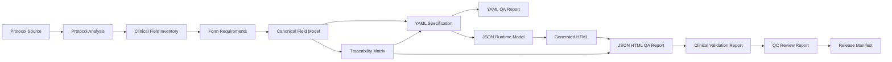
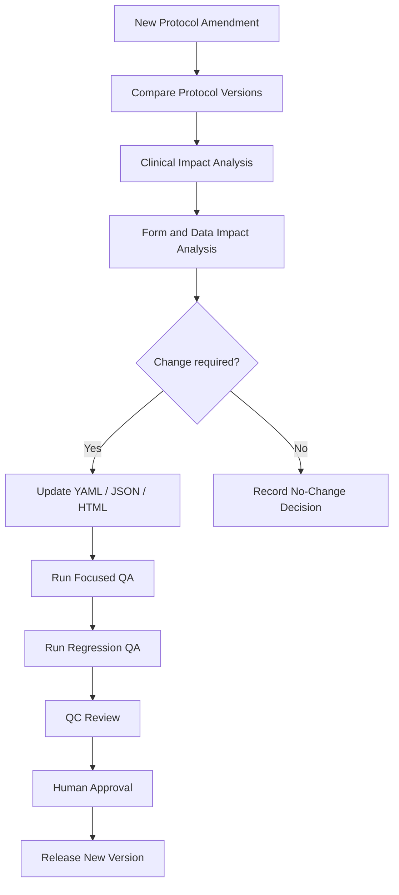

# Clinical Form Studio — System Architecture

**Document ID:** DOC-01  
**Document Type:** System Architecture  
**Document Version:** 2.0  
**Status:** Draft  
**Primary Audience:** Product Owner, Clinical Reviewer, Clinic Agent Owner, Solution Architect, Software Developer, QA Engineer  
**Last Updated:** 2026-07-21  
**Related Documents:**

- `02-orchestrator-skill.md`
- `03-workflow-definition.md`
- `04-agent-registry.md`
- `05-project-state-schema.md`
- `06-naming-and-governance.md`

---

## 1. Purpose

This document defines the system architecture for **Clinical Form Studio**, an AI-assisted platform that transforms a clinical trial protocol into a structured, clinically reviewable, testable, and deployable electronic case report form (eCRF).

The platform is designed as an **AI-coordinated clinical form engineering lifecycle**, not as a single prompt or one-step form generator.

The architecture contains:

- One central **Clinical Form Orchestrator**
- Four role-based AI Agents: **Clinic, SA, SD, and QA**
- Multiple reusable Skills owned by each Agent
- YAML as the human-readable clinical form specification
- JSON as the runtime and HTTP-friendly representation
- A reusable HTML Render Engine
- A YAML HTML workspace for clinical field review and editing
- Two levels of Playwright-based automated testing
- GitHub-based source control and CI/CD publishing
- Human review checkpoints and traceable project artifacts

---

## 2. Product Vision

Clinical Form Studio converts a protocol into a deployable eCRF through a controlled workflow:

```text
Protocol
  → Clinic Analysis
  → Protocol-to-YAML Generation
  → YAML HTML Review and Field Editing
  → YAML HTML QA
  → YAML-to-JSON Transformation
  → JSON-to-HTML Runtime Rendering
  → JSON HTML QA
  → Human Approval
  → GitHub and CI/CD Publishing
```

The core value is not only automated form generation.

The system provides a governed process that can:

1. Understand protocol-specific data collection requirements.
2. Generate an initial YAML form specification.
3. Present YAML-defined fields through an interactive HTML review interface.
4. Allow clinical users to validate, add, edit, and remove fields.
5. Transform approved YAML into a runtime JSON model.
6. Render deterministic HTML from the runtime model.
7. Test both the YAML review interface and the JSON-driven runtime form.
8. Route defects to the correct professional role.
9. Preserve traceability across protocol, YAML, JSON, HTML, tests, GitHub, and deployment.
10. Support future workflow scenario testing, dashboards, and study operations features.

---

## 3. Architecture Principles

### 3.1 Orchestration over monolithic prompting

The Orchestrator must not perform every task itself.

It is responsible for:

- Understanding the user goal
- Initializing or loading the project
- Inspecting available project artifacts
- Determining the current workflow state
- Identifying missing information
- Selecting the next Agent
- Allowing the selected Agent to choose and execute its Skill
- Enforcing workflow gates
- Routing defects and retries
- Requesting human confirmation when required
- Reporting project status and blockers

Domain-specific work must be delegated to the relevant Agent.

The preferred execution pattern is:

```text
Orchestrator
  → Select Role
  → Role Selects Skill
  → Skill Executes
  → Artifact Is Produced
  → Gate Is Evaluated
  → Project State Is Updated
```

---

### 3.2 Four-role responsibility model

An **Agent** represents a professional role and owns a clear responsibility boundary.

- **Clinic Agent** owns protocol interpretation, Protocol-to-YAML generation, and clinical field review through the YAML HTML workspace.
- **Solution Architect Agent** owns YAML, JSON, and HTML transformation architecture and the HTML Render Engine.
- **Software Developer Agent** owns GitHub integration, CI/CD, HTML publishing, deployment, and future dashboard development.
- **QA Agent** owns YAML HTML testing, JSON HTML testing, regression testing, and future scenario-flow test design.

Quality review and release approval remain explicit workflow gates, but they are not separate AI roles in the current architecture.

---

### 3.3 Role owns multiple Skills

A Role is not equivalent to one Skill.

Each Agent may own multiple reusable Skills that represent the capabilities of that professional function.

```text
Role
  ├─ Skill A
  ├─ Skill B
  ├─ Skill C
  └─ Future Skills
```

Each Skill must have one primary owning Agent, even when another Agent consumes its output.

---

### 3.4 Artifact-driven collaboration

Agents collaborate through structured project artifacts rather than relying only on conversational memory.

Primary artifacts include:

- Project metadata
- Protocol source
- Protocol analysis report
- YAML form specification
- YAML HTML review workspace
- Clinical field review record
- YAML HTML QA report
- JSON runtime model
- Generated runtime HTML
- JSON HTML QA report
- Scenario test specification
- Git commit and build references
- Deployment manifest
- Dashboard configuration and operational data, when implemented

---

### 3.5 Human-in-the-loop clinical governance

The system must request human review when:

- Clinical meaning is ambiguous.
- Protocol requirements conflict.
- A required field cannot be inferred safely.
- CDASH mapping is uncertain.
- A field affects eligibility, safety, endpoints, or regulatory reporting.
- A clinical reviewer edits or removes an AI-generated field.
- A protocol amendment changes an approved YAML artifact.
- QA repeatedly fails after correction attempts.
- The form is ready for release approval.

Automated testing may verify behavior, but it must not replace clinical approval.

---

### 3.6 Separate content ownership from engine ownership

The architecture distinguishes between **using a capability** and **owning its implementation**.

Example:

- Clinic uses the YAML HTML workspace to review and edit fields.
- SA owns the technical renderer and transformation logic that creates the workspace.
- QA tests the workspace behavior.
- SD publishes the approved implementation.

This prevents responsibility overlap while preserving a practical end-to-end workflow.

---

### 3.7 Traceability by default

Every major artifact should include:

- Project code
- Protocol identifier
- Protocol version
- Artifact type
- Artifact version
- Generation timestamp
- Responsible Agent
- Source artifact references
- Review status
- Test status
- Change summary

---

### 3.8 Deterministic transformation

For the same approved source artifact and engine version, the transformation result should be reproducible.

```text
Approved YAML + Converter Version
  → Same JSON

Approved JSON + Renderer Version
  → Same HTML Structure and Behavior
```

This principle is required for reliable QA, regression testing, version comparison, and deployment.

---

## 4. Logical Architecture

```mermaid
flowchart TB
    U[User / Clinical Reviewer]
    O[Clinical Form Orchestrator]

    C[Clinic Agent]
    SA[Solution Architect Agent]
    SD[Software Developer Agent]
    QA[QA Agent]

    C1[Protocol Analysis Skill]
    C2[Protocol-to-YAML Skill]
    C3[Clinical Field Review and Edit Skill]
    C4[Protocol Amendment Impact Skill]

    SA1[YAML Schema and Validation Skill]
    SA2[YAML Review HTML Rendering Skill]
    SA3[YAML-to-JSON Conversion Skill]
    SA4[JSON-to-HTML Render Engine Skill]
    SA5[Transformation Repair Skill]

    SD1[GitHub Repository Skill]
    SD2[CI/CD Build and Publish Skill]
    SD3[Deployment Verification Skill]
    SD4[Dashboard and Platform Skill]

    QA1[YAML HTML Playwright QA Skill]
    QA2[JSON HTML Playwright QA Skill]
    QA3[Regression QA Skill]
    QA4[Scenario Flow Test Design Skill]
    QA5[QA Evidence and Report Skill]

    A[(Project Artifacts)]
    S[(Project State)]
    G[(GitHub Repository)]
    E[(Published Environment)]

    U --> O
    O <--> S
    O <--> A

    O --> C
    O --> SA
    O --> SD
    O --> QA

    C --> C1
    C --> C2
    C --> C3
    C --> C4

    SA --> SA1
    SA --> SA2
    SA --> SA3
    SA --> SA4
    SA --> SA5

    SD --> SD1
    SD --> SD2
    SD --> SD3
    SD --> SD4

    QA --> QA1
    QA --> QA2
    QA --> QA3
    QA --> QA4
    QA --> QA5

    C1 --> A
    C2 --> A
    C3 --> A
    C4 --> A

    SA1 --> A
    SA2 --> A
    SA3 --> A
    SA4 --> A
    SA5 --> A

    QA1 --> A
    QA2 --> A
    QA3 --> A
    QA4 --> A
    QA5 --> A

    SD1 <--> G
    SD2 --> G
    G --> E
    SD3 <--> E
    SD4 <--> E

    O --> U
```



---

## 5. Architectural Layers

### 5.1 Interaction Layer

The Interaction Layer includes:

- Codex conversation
- Protocol upload or text input
- Visual page annotation
- YAML HTML field review and editing
- Human review and approval
- Targeted clarification questions
- Progress, defect, and deployment reporting

The user interacts primarily with the Orchestrator and the generated review interfaces.

---

### 5.2 Orchestration Layer

The Orchestration Layer is the control plane of the system.

It manages:

- Project initialization
- Workflow state
- Agent selection
- Skill sequencing
- Artifact dependency checking
- Quality gate evaluation
- Defect classification and routing
- Human review checkpoints
- Retry limits
- Completion criteria

The Orchestrator behaves as a combination of:

- Project Manager
- Workflow Engine
- Technical Coordinator
- Quality Gate Controller

It does not replace Clinic, SA, SD, or QA expertise.

---

### 5.3 Agent Layer

The Agent Layer contains four professional roles:

1. Clinic
2. Solution Architect
3. Software Developer
4. QA

Each Agent definition must specify:

- Mission
- Scope
- Responsibilities
- Owned Skills
- Required inputs
- Expected outputs
- Decision rules
- Escalation rules
- Completion criteria
- Prohibited actions

---

### 5.4 Skill Layer

The Skill Layer contains reusable execution units.

A Skill should be:

- Focused on one capability
- Independently testable
- Explicit about input and output
- Safe to retry
- Traceable to an owning Agent
- Clear about failure conditions
- Clear about whether human approval is required

---

### 5.5 Artifact Layer

The Artifact Layer is the shared working memory of the project.

Artifacts should be stored as files whenever practical so they can be:

- Version controlled
- Reviewed
- Compared
- Tested
- Re-generated
- Audited
- Included in CI/CD
- Associated with a protocol and project version

---

### 5.6 Transformation and Render Layer

This layer is owned by the Solution Architect Agent and contains:

- YAML schema validation
- YAML-to-JSON conversion
- JSON schema validation
- YAML review HTML rendering
- JSON runtime HTML rendering
- Shared form components
- Validation rule execution
- Conditional display behavior
- Stable selectors for Playwright

The Render Engine is a reusable platform component, not a one-time generated page.

---

### 5.7 Quality Layer

The Quality Layer contains two current automated gates and one future expansion area:

1. **YAML HTML QA** — validates the YAML-driven review and editing experience.
2. **JSON HTML QA** — validates the runtime HTML generated from JSON.
3. **Scenario Flow QA** — future capability for testing complete clinical workflows and user journeys.

Quality is enforced throughout the workflow rather than represented by one final test.

---

### 5.8 Delivery Layer

The Delivery Layer is owned by the Software Developer Agent and contains:

- GitHub repository operations
- Branch, commit, and pull request workflow
- Build automation
- CI/CD pipeline
- Static HTML or application publishing
- Environment configuration
- Deployment verification
- Rollback references
- Future dashboard and operational platform features

---

## 6. Agent Responsibility Model

## 6.1 Clinic Agent

### Mission

Convert a clinical trial protocol into a clinically meaningful, human-reviewable, and approved YAML form specification.

### Primary responsibilities

- Read and interpret the protocol.
- Identify study visits, procedures, assessments, endpoints, safety data, eligibility criteria, and required observations.
- Extract candidate clinical data collection fields.
- Generate the initial YAML form specification from the protocol.
- Define field labels, clinical meaning, data types, units, controlled values, required status, ranges, and source references.
- Use the YAML HTML review workspace to validate generated fields.
- Add, edit, remove, reorder, or clarify fields through the review interface.
- Confirm that the YAML accurately represents the intended clinical data collection.
- Record unresolved ambiguity and ask targeted clinical questions.
- Review protocol amendment impact and update affected YAML content.
- Review future CDASH candidates or mappings when the capability is added.

### Owned skills

- Protocol Intake and Analysis Skill
- Clinical Requirement Extraction Skill
- Protocol-to-YAML Generation Skill
- YAML Clinical Content Validation Skill
- YAML HTML Field Review and Edit Skill
- Clinical Ambiguity Detection Skill
- Protocol Amendment Impact Analysis Skill
- Clinical Review Record Skill
- Future CDASH Mapping Review Skill

### Primary inputs

- Protocol file or protocol text
- Project metadata
- Existing YAML, when revising a project
- Protocol amendment or previous protocol version
- Human clinical feedback

### Primary outputs

- Protocol analysis report
- Visit and assessment inventory
- Initial YAML form specification
- Revised and clinically approved YAML
- Clinical field review record
- Clinical clarification questions
- Amendment impact report
- Clinical approval status

### Key decision boundary

The Clinic Agent answers:

> What clinical data must be collected, and does the YAML accurately represent the protocol?

The Clinic Agent owns the **clinical content of YAML**.

It does not own:

- YAML-to-JSON converter implementation
- JSON schema architecture
- HTML Render Engine implementation
- Playwright test implementation
- GitHub publishing
- Deployment infrastructure

The Clinic Agent may use the YAML HTML workspace, but the technical rendering engine is owned by the Solution Architect Agent.

---

## 6.2 Solution Architect Agent

### Mission

Transform the approved YAML specification into deterministic, reusable, and runtime-ready JSON and HTML artifacts through a governed Render Engine.

### Primary responsibilities

- Define and maintain the YAML schema required by the platform.
- Validate whether YAML is structurally suitable for transformation.
- Design the canonical field and form model shared across YAML, JSON, and HTML.
- Implement or govern the YAML-to-JSON transformation contract.
- Preserve all approved clinical meaning during transformation.
- Define and validate the JSON runtime schema.
- Own the HTML Render Engine architecture.
- Render the YAML HTML review workspace used by Clinic.
- Render the JSON-driven runtime HTML used by the deployed eCRF.
- Define stable element identifiers and test hooks for QA.
- Implement validation rules, conditional display logic, repeatable sections, and component behavior.
- Ensure deterministic and versioned transformation.
- Analyze and repair converter or renderer defects.
- Assess architectural impact when YAML structure or protocol requirements change.

### Owned skills

- Canonical Form Model Skill
- YAML Schema Validation Skill
- YAML Review HTML Rendering Skill
- YAML-to-JSON Conversion Skill
- JSON Schema Validation Skill
- JSON-to-HTML Generation Skill
- HTML Render Engine Skill
- Form Component Architecture Skill
- Validation and Conditional Logic Skill
- Cross-Artifact Consistency Skill
- Transformation Defect Repair Skill
- Renderer Versioning Skill

### Primary inputs

- Clinically reviewed YAML
- YAML schema
- Render configuration
- Existing converter and renderer source code
- QA defect reports
- Version and traceability metadata

### Primary outputs

- YAML validation result
- YAML HTML review workspace
- JSON runtime model
- JSON validation result
- Runtime HTML
- Render Engine source or configuration
- Transformation traceability record
- Architecture change report
- Transformation defect resolution report

### Key decision boundary

The Solution Architect Agent answers:

> How should approved YAML be transformed into a valid JSON runtime model and consistently rendered as HTML?

The Solution Architect Agent owns the **conversion and rendering architecture**.

It does not independently change clinical meaning. Any change that affects field meaning, required status, terminology, range, visit, endpoint, or safety intent must be returned to Clinic.

It also does not own:

- GitHub release workflow
- Production deployment
- Operational dashboard development
- Independent test approval

---

## 6.3 Software Developer Agent

### Mission

Deliver, publish, operate, and extend the Clinical Form Studio implementation through GitHub, CI/CD, deployment automation, and future platform features.

### Primary responsibilities

- Create and maintain the GitHub repository structure.
- Manage branches, commits, pull requests, and version tags.
- Integrate generated YAML, JSON, HTML, tests, and reports into source control.
- Configure build and packaging workflows.
- Implement GitHub Actions or equivalent CI/CD pipelines.
- Publish the generated HTML review site and runtime eCRF.
- Manage environment-specific configuration.
- Verify deployment results and published URLs.
- Preserve deployment evidence and rollback references.
- Diagnose source-control, build, packaging, and publishing failures.
- Maintain the web application shell and hosting integration.
- Develop future dashboards for projects, protocol versions, QA status, releases, and operational monitoring.
- Develop future user, audit, study, and environment management features.

### Owned skills

- GitHub Repository Initialization Skill
- Branch and Commit Management Skill
- Pull Request and Version Tag Skill
- Build and Packaging Skill
- GitHub Actions CI/CD Skill
- HTML Publish Skill
- Deployment Verification Skill
- Rollback Preparation Skill
- Environment Configuration Skill
- Dashboard Development Skill
- Application Platform Extension Skill
- Operational Monitoring Skill

### Primary inputs

- Approved YAML, JSON, and HTML artifacts
- Render Engine source
- Playwright test suite and QA reports
- Repository configuration
- Deployment target and environment settings
- Human release approval

### Primary outputs

- Git repository and commit references
- Pull request or release tag
- Build artifact
- CI/CD execution result
- Published HTML or application URL
- Deployment report
- Rollback reference
- Future dashboards and operational features

### Key decision boundary

The Software Developer Agent answers:

> How should the approved and tested artifacts be versioned, built, published, operated, and extended as a software platform?

The Software Developer Agent owns **delivery and platform implementation**.

It must not independently redefine:

- Clinical field meaning
- YAML clinical content
- YAML-to-JSON transformation semantics
- Render Engine architecture
- QA acceptance criteria

Defects in these areas must be routed to Clinic, SA, or QA.

---

## 6.4 QA Agent

### Mission

Verify that both the YAML-driven clinical review interface and the JSON-driven runtime form behave according to their approved specifications, and evolve toward full clinical scenario testing.

### Primary responsibilities

- Generate executable tests from YAML, JSON, form rules, and acceptance criteria.
- Run Playwright tests against the YAML HTML review workspace.
- Run Playwright tests against the JSON-driven runtime HTML.
- Validate field presence, labels, identifiers, required states, data types, ranges, formats, options, and conditional logic.
- Verify that Clinic can review and edit YAML-defined fields correctly.
- Verify that YAML-to-JSON transformation does not lose or alter approved information.
- Verify that JSON-to-HTML rendering is deterministic and behaviorally correct.
- Capture screenshots, traces, logs, videos, and reproducible failure evidence.
- Classify defects and route them to Clinic, SA, SD, or QA.
- Re-run focused and regression tests after corrections.
- Produce machine-readable and human-readable QA reports.
- Design future scenario-based tests for complete clinical workflows.

### Owned skills

#### Skill A — YAML HTML Playwright QA

Validates the HTML workspace generated from the YAML specification and used by Clinic for field validation and editing.

The Skill verifies:

- Every YAML-defined field is displayed.
- Labels and stable identifiers match YAML.
- Required and optional states are correct.
- Field data types render correctly.
- Min/max, pattern, format, and option constraints behave correctly.
- Conditional fields appear and disappear correctly.
- Sections, visits, and repeatable groups are represented correctly.
- Add, edit, remove, and save actions update the expected YAML content.
- Invalid edits are rejected or clearly reported.
- Clinical review status is recorded correctly.

#### Skill B — JSON HTML Playwright QA

Validates the runtime HTML generated from the JSON model.

The Skill verifies:

- YAML-to-JSON transformation preserves approved content.
- JSON is structurally valid and suitable for HTTP/API communication.
- JSON-driven HTML contains all expected fields.
- Runtime validation behavior is correct.
- Conditional logic and repeatable groups work correctly.
- Stable selectors and accessibility semantics are present.
- Rendering is deterministic for the same JSON and engine version.
- End-to-end user interactions pass.

#### Skill C — Scenario Flow Test Design and Execution

This is a future capability for validating complete clinical or operational journeys.

Example flows:

```text
Screening
  → Eligibility Review
  → Baseline Assessment
  → Treatment Visit
  → Adverse Event Entry
  → Follow-up
  → Form Completion
```

The Skill should eventually support:

- AI-generated scenario test cases
- Positive and negative scenarios
- Cross-form dependencies
- Visit sequencing
- Role-specific user actions
- Incomplete form and exception handling
- Protocol amendment regression scenarios
- End-to-end traceability from scenario to test evidence

#### Supporting QA skills

- Cross-Artifact Comparison Skill
- Regression Test Skill
- Focused Retest Skill
- Screenshot and Evidence Capture Skill
- QA Report Generation Skill
- Test Data Generation Skill
- Test Coverage Analysis Skill

### Primary outputs

- YAML HTML QA report
- JSON HTML QA report
- Playwright test results
- Screenshots, traces, videos, and logs
- Regression report
- Defect list
- Scenario test specification
- QA completion status

### Key decision boundary

The QA Agent answers:

> Does each generated interface behave correctly, and is there sufficient evidence that the approved specification has been preserved?

The QA Agent must not:

- Approve clinical meaning
- Silently modify YAML, JSON, renderer code, or deployment configuration
- Mark a failed test as passed without evidence
- Publish an unapproved build

---

## 7. Role-to-Skill Mapping

| Role | Primary Capability | Current Skills | Future Expansion |
|---|---|---|---|
| Orchestrator | Workflow control | Initialize project, inspect state, select Agent, enforce gates, route defects | Multi-project coordination, policy-driven workflow |
| Clinic | Protocol and clinical YAML ownership | Protocol analysis, Protocol-to-YAML, YAML HTML field review and edit | CDASH review, amendment intelligence, clinical rule assistant |
| Solution Architect | Transformation and rendering | YAML validation, YAML review HTML, YAML-to-JSON, JSON-to-HTML, Render Engine | Multi-renderer support, schema registry, reusable component marketplace |
| Software Developer | Delivery and platform | GitHub, CI/CD, HTML publishing, deployment verification | Dashboards, monitoring, user management, audit and study operations |
| QA | Automated verification | YAML HTML QA, JSON HTML QA, regression and evidence | Scenario flow design, AI test generation, cross-study test suites |

---

## 8. Role Boundary Summary

| Artifact or Capability | Owner | Primary Consumer | Approval or Verification |
|---|---|---|---|
| Protocol interpretation | Clinic | Orchestrator, human reviewer | Human clinical review when required |
| YAML clinical content | Clinic | SA, QA | Clinic or human clinical approval |
| YAML HTML review workspace | SA | Clinic | QA YAML HTML tests |
| YAML schema | SA | Clinic, QA | QA structural tests |
| YAML-to-JSON transformation | SA | QA, SD | QA cross-artifact tests |
| JSON runtime schema | SA | QA, SD | QA JSON validation |
| HTML Render Engine | SA | Clinic, QA, SD | QA behavior tests |
| GitHub repository | SD | All roles | CI checks |
| CI/CD and publishing | SD | User, Orchestrator | Deployment verification |
| YAML HTML test suite | QA | Orchestrator, Clinic, SA | QA evidence |
| JSON HTML test suite | QA | Orchestrator, SA, SD | QA evidence |
| Scenario flow tests | QA | Product owner, clinical reviewer | Future QA evidence |
| Final release approval | Human reviewer | SD | Explicit approval record |

---

## 9. Core Workflow



---

## 10. Workflow Stages and Gates

| Stage | Primary Owner | Required Input | Output | Exit Gate |
|---|---|---|---|---|
| Project Initialization | Orchestrator | User request | Project metadata and project state | Project code and context confirmed |
| Protocol Intake | Orchestrator | Protocol file or text | Registered protocol source | Protocol readable |
| Protocol Analysis | Clinic | Protocol | Protocol analysis | Ambiguities resolved or recorded |
| Protocol-to-YAML | Clinic | Protocol analysis | Initial YAML | Required clinical concepts represented |
| YAML Structural Validation | SA | YAML | Validation result | YAML conforms to platform schema |
| YAML HTML Rendering | SA | Valid YAML | Review workspace | Workspace loads successfully |
| Clinical Field Review | Clinic / Human Reviewer | YAML review workspace | Approved or revised YAML | Clinical YAML approved |
| YAML HTML QA | QA | YAML and review workspace | QA evidence | Review and edit tests passed |
| YAML-to-JSON | SA | Approved YAML | JSON runtime model | JSON valid and traceable |
| JSON-to-HTML Runtime Rendering | SA | JSON runtime model | Runtime HTML | Rendering completed |
| JSON HTML QA | QA | JSON and runtime HTML | QA evidence | Runtime tests passed |
| Human Release Approval | Human Reviewer | Complete tested package | Approval record | Explicit approval |
| GitHub Versioning | SD | Approved artifacts | Commit, tag, or pull request | Source controlled |
| CI/CD Publish | SD | Versioned build | Published environment | Deployment verified |
| Dashboard and Operations | SD | Deployed project data | Dashboard or operational view | Future capability-specific gate |

---

## 11. Project Initialization

Every protocol must be processed within an explicit project context.

The Orchestrator must initialize or confirm:

- Project name
- Project code
- Protocol title
- Protocol number
- Protocol version
- Sponsor or organization, when applicable
- Therapeutic area
- Intended review environment
- Intended publication environment
- Repository or project directory
- Primary clinical reviewer
- Creation date
- Current workflow state

### Default project code

When the user does not provide a project code, the system may propose:

```text
PR-YYYYMMDD
```

Example:

```text
PR-20260721
```

When multiple projects are created on the same date, append a sequence:

```text
PR-20260721-01
PR-20260721-02
```

The user must be allowed to:

- Accept the generated code
- Provide a custom code
- Provide a project name while retaining the generated code

No protocol processing should begin until the project context is established.

---

## 12. Artifact Flow

```mermaid
flowchart LR
    P[Protocol Source]
    PA[Protocol Analysis]
    YD[Initial YAML Draft]
    YV[YAML Structural Validation]
    YH[YAML HTML Review Workspace]
    YE[Clinical Field Edits]
    YA[Approved YAML]
    YQR[YAML HTML QA Report]
    J[JSON Runtime Model]
    H[Runtime HTML]
    JQR[JSON HTML QA Report]
    AR[Human Approval Record]
    GR[Git Commit / Release Tag]
    DP[Published Environment]
    DB[Future Dashboard]

    P --> PA
    PA --> YD
    YD --> YV
    YV --> YH
    YH --> YE
    YE --> YD
    YH --> YA
    YA --> YQR
    YQR --> J
    J --> H
    H --> JQR
    JQR --> AR
    AR --> GR
    GR --> DP
    DP --> DB
```



---

## 13. Canonical Artifact Definitions

### 13.1 Protocol analysis report

Contains:

- Protocol metadata
- Study objectives
- Endpoints
- Visit schedule
- Assessments
- Eligibility criteria
- Safety requirements
- Data collection obligations
- Identified ambiguity
- Proposed clarification questions
- Source section references

---

### 13.2 YAML form specification

The YAML file is the human-readable and clinically governed form specification.

It should include:

- Project metadata
- Protocol metadata
- Form metadata
- Visits and sections
- Fields
- Clinical descriptions
- Data types
- Units
- Controlled terminology
- Required status
- Validation rules
- Conditions
- Repeatable groups
- Layout hints
- Protocol traceability references
- Review status
- Version information

Example:

```yaml
project:
  projectCode: PR-20260721
  protocolVersion: "1.0"

forms:
  - formId: VITAL_SIGNS
    title: Vital Signs
    visitScope:
      - SCREENING
    fields:
      - fieldId: VS_HEIGHT
        label: Height
        clinicalConcept: Body height
        dataType: decimal
        unit: cm
        required: true
        minValue: 30
        maxValue: 250
        source:
          protocolSection: "7.2.1"
        review:
          clinicalStatus: approved
```

Clinic owns the clinical content of this artifact.

SA owns the schema and transformation contract that consume it.

---

### 13.3 YAML HTML review workspace

The YAML HTML review workspace is an interactive interface used by Clinic and human reviewers.

It should support:

- Viewing all YAML-defined forms, sections, and fields
- Editing labels and descriptions
- Editing types, units, options, ranges, and required status
- Adding and removing fields
- Reordering fields and sections
- Reviewing protocol source references
- Displaying unresolved ambiguity
- Recording clinical approval status
- Saving changes back to YAML
- Stable selectors for Playwright testing
- Clear validation and error feedback

The workspace is technically rendered by SA-owned components but operationally used by Clinic.

---

### 13.4 JSON runtime model

The JSON file is the transport-friendly and runtime-oriented representation.

It should:

- Preserve all approved YAML semantics.
- Be valid for HTTP/API communication.
- Support deterministic HTML generation.
- Retain field identifiers and traceability references.
- Include schema and converter version information.
- Be machine validated before rendering.
- Avoid introducing clinical information not present in approved YAML.

---

### 13.5 Runtime HTML

The runtime HTML output should:

- Render all approved fields.
- Use stable element identifiers.
- Support Playwright automation.
- Display validation feedback.
- Apply conditional logic.
- Support repeatable groups where defined.
- Preserve accessibility semantics.
- Identify project, schema, renderer, and build versions.
- Be reproducible from the JSON model and renderer version.

---

### 13.6 QA report

Each QA report should include:

- Project code
- Protocol version
- Build version
- Tested artifact versions
- Converter and renderer versions
- Test environment
- Test scenarios
- Pass/fail status
- Failure classification
- Expected and actual results
- Screenshots, traces, logs, or videos
- Responsible defect owner
- Retest result
- Coverage summary

---

### 13.7 Human approval record

The approval record should include:

- Project and protocol version
- Approved YAML version
- Approved JSON and HTML build
- QA report references
- Reviewer identity or role
- Approval date and time
- Approval decision
- Conditions or comments

---

### 13.8 Git and deployment record

The delivery record should include:

- Repository
- Branch
- Commit hash
- Pull request or release tag
- CI/CD workflow run
- Build artifact reference
- Target environment
- Published URL
- Deployment status
- Deployment timestamp
- Rollback reference

---

### 13.9 Future scenario test specification

A scenario test specification may include:

- Scenario ID
- Clinical purpose
- Preconditions
- User role
- Required test data
- Visit or workflow sequence
- Expected field behavior
- Expected validation and exception behavior
- Cross-form dependencies
- Expected final state
- Traceability to protocol and YAML fields

---

## 14. Defect Routing Rules

Defects must be routed according to their root cause.

| Defect Type | Primary Owner | Supporting Role |
|---|---|---|
| Missing protocol requirement | Clinic | Orchestrator |
| Incorrect clinical meaning | Clinic | Human clinical reviewer |
| Incorrect field, unit, range, option, or required status in YAML | Clinic | SA when schema-limited |
| Invalid YAML structure | Clinic or SA | QA |
| YAML HTML workspace does not show a valid field | SA | QA |
| YAML edit does not save correctly | SA | Clinic and QA |
| YAML-to-JSON data loss | SA | QA |
| Invalid JSON runtime structure | SA | QA |
| HTML rendering defect | SA | QA |
| Incorrect conditional behavior caused by renderer | SA | QA |
| Incorrect conditional requirement in YAML | Clinic | SA and QA |
| Test implementation error | QA | SA or SD depending on environment |
| Test coverage gap | QA | Clinic or SA for acceptance criteria |
| Git, branch, commit, or merge failure | SD | Orchestrator |
| CI/CD build failure | SD | SA when caused by renderer integration |
| Publish or deployment failure | SD | Orchestrator |
| Dashboard or operational platform defect | SD | QA |
| Workflow state or routing error | Orchestrator | Owning Agent |

The Orchestrator must not route every defect directly to SD.

It should identify whether the root cause is:

- Clinical content
- YAML structure
- Transformation contract
- Render Engine
- Test design or execution
- Git and build pipeline
- Deployment environment
- Workflow orchestration

---

## 15. Change and Amendment Handling

When a protocol amendment is introduced, the system should not regenerate everything blindly.

The Orchestrator should trigger:

1. Protocol version comparison.
2. Clinical impact analysis by Clinic.
3. Targeted YAML updates by Clinic.
4. YAML schema and render impact analysis by SA.
5. Focused YAML HTML QA by QA.
6. YAML-to-JSON and JSON-to-HTML regeneration by SA.
7. Focused and regression JSON HTML QA by QA.
8. Human approval.
9. GitHub versioning and publishing by SD.



---

## 16. Project State Model

The Orchestrator should maintain a project state document.

Example:

```yaml
project:
  projectCode: PR-20260721
  projectName: OSA CBCT Clinical Form
  protocolVersion: "1.0"
  status: runtime_qa
  createdAt: "2026-07-21T07:00:00+08:00"
  updatedAt: "2026-07-21T08:30:00+08:00"

workflow:
  currentStage: JSON_HTML_QA
  completedStages:
    - PROJECT_INITIALIZATION
    - PROTOCOL_INTAKE
    - PROTOCOL_ANALYSIS
    - YAML_GENERATION
    - YAML_SCHEMA_VALIDATION
    - YAML_HTML_REVIEW
    - CLINICAL_YAML_APPROVAL
    - YAML_HTML_QA
    - JSON_GENERATION
    - HTML_GENERATION
  blocked: false
  activeAgent: QA
  nextAction: RUN_JSON_HTML_PLAYWRIGHT_QA

artifacts:
  protocol:
    path: projects/PR-20260721/input/protocol.pdf
    status: available
  protocolAnalysis:
    path: projects/PR-20260721/clinic/protocol-analysis.md
    status: reviewed
  yaml:
    path: projects/PR-20260721/spec/form.yaml
    version: "1.2"
    status: clinical_approved
  yamlReviewHtml:
    path: projects/PR-20260721/review/index.html
    status: qa_passed
  json:
    path: projects/PR-20260721/runtime/form.json
    status: generated
  html:
    path: projects/PR-20260721/output/index.html
    status: generated

quality:
  yamlHtmlQaStatus: passed
  jsonHtmlQaStatus: in_progress
  scenarioQaStatus: not_applicable

release:
  humanApproval: pending
  gitCommit: null
  deploymentStatus: not_started
  publishedUrl: null

openQuestions: []
openDefects: []
```

---

## 17. Suggested Repository Structure

```text
/
├─ AGENTS.md
├─ README.md
│
├─ agents/
│  ├─ orchestrator-agent.md
│  ├─ clinic-agent.md
│  ├─ solution-architect-agent.md
│  ├─ software-developer-agent.md
│  └─ qa-agent.md
│
├─ skills/
│  ├─ clinic/
│  │  ├─ protocol-analysis/
│  │  │  └─ SKILL.md
│  │  ├─ protocol-to-yaml/
│  │  │  └─ SKILL.md
│  │  ├─ yaml-clinical-validation/
│  │  │  └─ SKILL.md
│  │  ├─ yaml-html-field-review/
│  │  │  └─ SKILL.md
│  │  └─ protocol-amendment-impact/
│  │     └─ SKILL.md
│  │
│  ├─ architecture/
│  │  ├─ canonical-form-model/
│  │  │  └─ SKILL.md
│  │  ├─ yaml-schema-validation/
│  │  │  └─ SKILL.md
│  │  ├─ yaml-review-html-rendering/
│  │  │  └─ SKILL.md
│  │  ├─ yaml-to-json/
│  │  │  └─ SKILL.md
│  │  ├─ json-schema-validation/
│  │  │  └─ SKILL.md
│  │  ├─ json-to-html/
│  │  │  └─ SKILL.md
│  │  └─ html-render-engine/
│  │     └─ SKILL.md
│  │
│  ├─ development/
│  │  ├─ github-repository/
│  │  │  └─ SKILL.md
│  │  ├─ branch-commit-release/
│  │  │  └─ SKILL.md
│  │  ├─ ci-cd-publish/
│  │  │  └─ SKILL.md
│  │  ├─ deployment-verification/
│  │  │  └─ SKILL.md
│  │  └─ dashboard-platform/
│  │     └─ SKILL.md
│  │
│  └─ qa/
│     ├─ yaml-html-playwright-qa/
│     │  └─ SKILL.md
│     ├─ json-html-playwright-qa/
│     │  └─ SKILL.md
│     ├─ regression-qa/
│     │  └─ SKILL.md
│     ├─ scenario-flow-test-design/
│     │  └─ SKILL.md
│     └─ qa-report/
│        └─ SKILL.md
│
├─ docs/
│  ├─ 01-system-architecture.md
│  ├─ 02-orchestrator-skill.md
│  ├─ 03-workflow-definition.md
│  ├─ 04-agent-registry.md
│  ├─ 05-project-state-schema.md
│  └─ 06-naming-and-governance.md
│
├─ schemas/
│  ├─ project-state.schema.json
│  ├─ form-yaml.schema.json
│  └─ form-runtime.schema.json
│
├─ templates/
│  ├─ project-state.template.yaml
│  ├─ form-yaml.template.yaml
│  ├─ clinical-review.template.md
│  ├─ qa-report.template.md
│  └─ scenario-test.template.yaml
│
├─ src/
│  ├─ converters/
│  │  └─ yaml-to-json/
│  ├─ render-engine/
│  ├─ yaml-review-ui/
│  ├─ runtime-web/
│  └─ dashboard/
│
├─ tests/
│  ├─ yaml-html/
│  ├─ json-html/
│  ├─ scenarios/
│  ├─ fixtures/
│  └─ reports/
│
└─ projects/
   └─ PR-YYYYMMDD/
      ├─ project-state.yaml
      ├─ input/
      ├─ clinic/
      ├─ spec/
      ├─ review/
      ├─ runtime/
      ├─ output/
      ├─ qa/
      ├─ release/
      └─ deployment/
```

---

## 18. Agent File Structure Standard

Each Agent Markdown file should follow a consistent structure:

```text
1. Role
2. Mission
3. Scope
4. Responsibilities
5. Owned Skills
6. Required Inputs
7. Expected Outputs
8. Decision Rules
9. Escalation Rules
10. Human Review Rules
11. Completion Criteria
12. Prohibited Actions
13. Response Format
```

Each Skill Markdown file should follow:

```text
1. Skill Name
2. Owning Agent
3. Purpose
4. Trigger Conditions
5. Preconditions
6. Inputs
7. Execution Steps
8. Outputs
9. Validation Rules
10. Failure Conditions
11. Retry Rules
12. Escalation Rules
13. Example
```

---

## 19. Orchestrator Control Requirements

The Orchestrator must always be able to answer:

1. What project is currently active?
2. What protocol and version are being processed?
3. What workflow stage is active?
4. Which artifacts already exist?
5. Which artifacts are clinically approved?
6. Which artifacts have passed QA?
7. What information is missing?
8. What is blocking progress?
9. Which Agent owns the next action?
10. Which Skill should that Agent execute?
11. What quality gate must be passed next?
12. Does the user need to review or approve anything?
13. Has the project been committed and published?

The Orchestrator should provide concise status updates using:

```text
Project:
Current Stage:
Completed:
Active Agent:
Active Skill:
Missing Information:
Next Action:
Quality Gate:
Human Review Required:
Blocking Issues:
Release Status:
```

---

## 20. Completion Criteria

An MVP project is complete only when:

- Project metadata is confirmed.
- The protocol source is registered.
- Clinic has completed protocol analysis.
- Clinic has generated the YAML specification.
- SA has validated the YAML structure.
- SA has rendered the YAML HTML review workspace.
- Clinic or the human clinical reviewer has approved the YAML fields.
- YAML HTML Playwright QA passes.
- SA has generated a valid JSON runtime model.
- SA has generated runtime HTML through the Render Engine.
- JSON HTML Playwright QA passes.
- Human release approval is recorded.
- SD has committed the approved artifacts to GitHub.
- CI/CD publishing succeeds.
- Deployment is verified.
- The published environment reference is recorded.
- The project state is marked as completed.

Future completion criteria may additionally require:

- Scenario-flow QA passes.
- Dashboard records the project and release status.
- Operational monitoring is enabled.
- Audit history is available.

---

## 21. Current MVP and Future Capability Boundaries

| Capability | MVP | Future |
|---|---:|---:|
| Protocol analysis | Yes | Enhanced amendment comparison |
| Protocol-to-YAML | Yes | Standard-aware auto-mapping |
| YAML HTML field review and editing | Yes | Collaborative review and comments |
| YAML-to-JSON conversion | Yes | Versioned schema migration |
| JSON-to-HTML Render Engine | Yes | Multiple themes and deployment targets |
| YAML HTML Playwright QA | Yes | Risk-based test selection |
| JSON HTML Playwright QA | Yes | Cross-browser and accessibility expansion |
| GitHub and CI/CD publishing | Yes | Controlled multi-environment promotion |
| Clinical scenario-flow testing | Basic design only | Full AI-generated end-to-end scenarios |
| Dashboard | Architecture placeholder | Project, QA, release, and audit dashboards |
| Operational monitoring | No | Health, usage, error, and performance monitoring |

---

## 22. Key Design Message

Clinical Form Studio is not a collection of disconnected prompts or isolated Skills.

It is an AI-coordinated clinical form engineering system modeled as a focused delivery team:

```text
Clinic
    interprets the protocol,
    creates clinical YAML,
    and validates fields through the YAML HTML workspace

Solution Architect
    owns YAML, JSON, and HTML transformation,
    and maintains the reusable HTML Render Engine

Software Developer
    owns GitHub, CI/CD, HTML publishing,
    deployment, and future dashboards

QA Engineer
    verifies YAML HTML and JSON HTML behavior,
    and evolves toward complete scenario-flow testing

Clinical Form Orchestrator
    coordinates the lifecycle,
    evaluates gates,
    routes defects,
    and asks the user only for genuinely missing information
```

This separation enables:

- Clear ownership
- Role-to-Skill extensibility
- Better defect routing
- Clinical control over form content
- Reusable transformation and rendering
- Independent automated verification
- Traceable GitHub delivery
- Safer deployment
- Controlled protocol revisions
- A clear path from MVP to a complete clinical form platform
r | YAML | JSON model | Transformation validation passed |
| Runtime Generation | Software Developer | JSON | HTML eCRF | Build completed |
| Runtime QA | QA Agent | JSON and HTML | QA evidence | End-to-end tests passed |
| Clinical Validation | Clinical Agent | Final fields and form | Validation report | Clinical sign-off recommendation |
| QC Review | QC Agent | Complete package | QC report | No unresolved critical finding |
| Human Approval | Human Reviewer | Reviewed package | Approval record | Explicit approval |
| Release | Release Manager | Approved package | Published eCRF | Deployment verified |

---

## 10. Project Initialization

Every protocol must be processed within an explicit project context.

The Orchestrator must initialize or confirm:

- Project name
- Project code
- Protocol title
- Protocol number
- Protocol version
- Sponsor or organization, when applicable
- Therapeutic area
- Intended environment
- Repository or project directory
- Primary reviewer
- Creation date
- Current workflow state

### Default project code

When the user does not provide a project code, the system may propose:

```text
PR-YYYYMMDD
```

Example:

```text
PR-20260721
```

When multiple projects are created on the same date, append a sequence:

```text
PR-20260721-01
PR-20260721-02
```

The user must be allowed to:

- Accept the generated code
- Provide a custom code
- Provide a project name while retaining the generated code

No protocol processing should begin until the project context is established.

---

## 11. Artifact Flow



---

## 12. Canonical Artifact Definitions

### 12.1 Protocol analysis report

Contains:

- Protocol metadata
- Study objectives
- Endpoints
- Visit schedule
- Assessments
- Eligibility criteria
- Safety requirements
- Data collection obligations
- Identified ambiguity
- Proposed clarification questions

---

### 12.2 Clinical field inventory

Each field should include:

- Clinical concept
- Proposed field name
- Description
- Source protocol section
- Visit or event
- Data type
- Unit
- Allowed values
- Required status
- Clinical importance
- Confidence
- Reviewer status

---

### 12.3 Form requirement specification

Contains:

- Form list
- Section structure
- Visit association
- Repeatable groups
- Dependencies
- Conditional display logic
- Edit checks
- User interactions
- Acceptance criteria

---

### 12.4 Canonical field model

The canonical model should be technology-neutral.

Suggested properties:

```yaml
fieldId: VS_HEIGHT
label: Height
clinicalConcept: Body height
dataType: decimal
unit: cm
required: true
minValue: 30
maxValue: 250
visitScope:
  - SCREENING
source:
  protocolSection: "7.2.1"
standards:
  cdashVariable: HEIGHT
review:
  clinicalStatus: approved
  architectureStatus: approved
```

---

### 12.5 YAML specification

The YAML file is the human-readable implementation specification.

It should include:

- Project metadata
- Form metadata
- Sections
- Fields
- Data types
- Terminology
- Validation rules
- Conditions
- Layout hints
- Traceability references
- Version information

---

### 12.6 JSON runtime model

The JSON file is the transport-friendly and runtime-oriented representation.

It should:

- Preserve all approved YAML semantics.
- Be valid for HTTP/API communication.
- Support deterministic HTML generation.
- Retain field identifiers and traceability references.
- Include schema version information.
- Be machine validated before rendering.

---

### 12.7 Generated HTML

The HTML output should:

- Render all approved fields.
- Use stable element identifiers.
- Support Playwright automation.
- Display validation feedback.
- Apply conditional logic.
- Preserve accessibility semantics.
- Identify build and project versions.
- Be reproducible from the JSON model.

---

### 12.8 QA report

Each QA report should include:

- Project code
- Build version
- Tested artifact versions
- Test environment
- Test scenarios
- Pass/fail status
- Failure classification
- Screenshots
- Playwright trace reference
- Responsible owner
- Retest result

---

### 12.9 QC report

The QC report should include:

- Artifact completeness
- Traceability coverage
- Open findings
- Severity
- Required corrective action
- Required approval
- Release recommendation

---

## 13. Defect Routing Rules

Defects must be routed according to their root cause.

| Defect Type | Primary Owner | Supporting Role |
|---|---|---|
| Missing protocol requirement | Clinical Agent | Solution Architect |
| Incorrect clinical meaning | Clinical Agent | Solution Architect |
| Missing form or section | Solution Architect | Clinical Agent |
| Incorrect field type or rule | Solution Architect | Software Developer |
| Invalid YAML | Software Developer | Solution Architect |
| YAML-to-JSON data loss | Software Developer | QA Agent |
| HTML rendering defect | Software Developer | QA Agent |
| Incorrect conditional behavior | Solution Architect or Software Developer | QA Agent |
| Test coverage gap | QA Agent | Solution Architect |
| Missing traceability | Solution Architect | QC Agent |
| Incomplete review evidence | QC Agent | Orchestrator |
| Publish failure | Release Manager | Software Developer |

The Orchestrator must not route every failure directly to the Software Developer.

It should identify whether the defect originates from:

- Clinical interpretation
- Solution design
- Implementation
- Test design
- Quality documentation
- Release infrastructure

---

## 14. Change and Amendment Handling

When a protocol amendment is introduced, the system should not regenerate everything blindly.

The Orchestrator should trigger:

1. Protocol version comparison.
2. Amendment impact analysis by the Clinical Agent.
3. Form and data impact analysis by the Solution Architect.
4. Targeted implementation changes by the Software Developer.
5. Focused and regression QA by the QA Agent.
6. Traceability and release review by the QC Agent.
7. Human approval before release.



---

## 15. Project State Model

The Orchestrator should maintain a project state document.

Example:

```yaml
project:
  projectCode: PR-20260721
  projectName: OSA CBCT Clinical Form
  protocolVersion: "1.0"
  status: runtime_qa
  createdAt: "2026-07-21T07:00:00+08:00"
  updatedAt: "2026-07-21T08:30:00+08:00"

workflow:
  currentStage: JSON_HTML_QA
  completedStages:
    - PROJECT_INITIALIZATION
    - PROTOCOL_INTAKE
    - CLINICAL_ANALYSIS
    - SOLUTION_DESIGN
    - YAML_GENERATION
    - YAML_QA
    - JSON_GENERATION
    - HTML_GENERATION
  blocked: false
  nextAction: RUN_JSON_HTML_PLAYWRIGHT_QA

artifacts:
  protocol:
    path: projects/PR-20260721/input/protocol.pdf
    status: available
  clinicalAnalysis:
    path: projects/PR-20260721/clinical/protocol-analysis.md
    status: approved
  yaml:
    path: projects/PR-20260721/spec/form.yaml
    status: qa_passed
  json:
    path: projects/PR-20260721/runtime/form.json
    status: generated
  html:
    path: projects/PR-20260721/output/index.html
    status: generated

reviews:
  clinical:
    status: pending_final_validation
  qa:
    yamlQaStatus: passed
    jsonQaStatus: in_progress
  qc:
    status: not_started

openQuestions: []
openDefects: []
```

---

## 16. Suggested Repository Structure

```text
/
├─ AGENTS.md
├─ README.md
│
├─ agents/
│  ├─ orchestrator-agent.md
│  ├─ clinical-agent.md
│  ├─ solution-architect-agent.md
│  ├─ software-developer-agent.md
│  ├─ qa-agent.md
│  ├─ qc-agent.md
│  └─ release-manager-agent.md
│
├─ skills/
│  ├─ clinical/
│  │  ├─ protocol-analysis/
│  │  │  └─ SKILL.md
│  │  └─ clinical-field-validation/
│  │     └─ SKILL.md
│  │
│  ├─ architecture/
│  │  ├─ form-requirement-design/
│  │  │  └─ SKILL.md
│  │  ├─ canonical-field-model/
│  │  │  └─ SKILL.md
│  │  └─ traceability-design/
│  │     └─ SKILL.md
│  │
│  ├─ development/
│  │  ├─ yaml-generation/
│  │  │  └─ SKILL.md
│  │  ├─ yaml-to-json/
│  │  │  └─ SKILL.md
│  │  ├─ json-to-html/
│  │  │  └─ SKILL.md
│  │  └─ implementation-repair/
│  │     └─ SKILL.md
│  │
│  ├─ qa/
│  │  ├─ yaml-html-playwright-qa/
│  │  │  └─ SKILL.md
│  │  ├─ json-html-playwright-qa/
│  │  │  └─ SKILL.md
│  │  └─ qa-report/
│  │     └─ SKILL.md
│  │
│  ├─ qc/
│  │  ├─ artifact-completeness-review/
│  │  │  └─ SKILL.md
│  │  └─ release-readiness-review/
│  │     └─ SKILL.md
│  │
│  └─ release/
│     └─ publish/
│        └─ SKILL.md
│
├─ docs/
│  ├─ 01-system-architecture.md
│  ├─ 02-orchestrator-skill.md
│  ├─ 03-workflow-definition.md
│  ├─ 04-agent-registry.md
│  ├─ 05-project-state-schema.md
│  └─ 06-naming-and-governance.md
│
├─ schemas/
│  ├─ project-state.schema.json
│  ├─ form-yaml.schema.json
│  └─ form-runtime.schema.json
│
├─ templates/
│  ├─ project-state.template.yaml
│  ├─ clinical-field-inventory.template.yaml
│  ├─ traceability-matrix.template.csv
│  ├─ qa-report.template.md
│  └─ qc-report.template.md
│
├─ src/
│  ├─ yaml-to-json/
│  ├─ json-to-html/
│  └─ web/
│
├─ tests/
│  ├─ yaml-html/
│  ├─ json-html/
│  ├─ fixtures/
│  └─ reports/
│
└─ projects/
   └─ PR-YYYYMMDD/
      ├─ project-state.yaml
      ├─ input/
      ├─ clinical/
      ├─ architecture/
      ├─ spec/
      ├─ runtime/
      ├─ output/
      ├─ qa/
      ├─ qc/
      └─ release/
```

---

## 17. Agent File Structure Standard

Each Agent Markdown file should follow a consistent structure:

```text
1. Role
2. Mission
3. Scope
4. Responsibilities
5. Owned Skills
6. Required Inputs
7. Expected Outputs
8. Decision Rules
9. Escalation Rules
10. Human Review Rules
11. Completion Criteria
12. Prohibited Actions
13. Response Format
```

Each Skill Markdown file should follow:

```text
1. Skill Name
2. Owning Agent
3. Purpose
4. Trigger Conditions
5. Preconditions
6. Inputs
7. Execution Steps
8. Outputs
9. Validation Rules
10. Failure Conditions
11. Retry Rules
12. Escalation Rules
13. Example
```

---

## 18. Orchestrator Control Requirements

The Orchestrator must always be able to answer:

1. What project is currently active?
2. What protocol and version are being processed?
3. What stage is currently active?
4. Which artifacts already exist?
5. Which artifacts are approved?
6. What information is missing?
7. What is blocking progress?
8. Which Agent owns the next action?
9. What quality gate must be passed next?
10. Does the user need to review or approve anything?

The Orchestrator should provide concise status updates using:

```text
Current Stage:
Completed:
Missing Information:
Active Agent:
Next Action:
Human Review Required:
Blocking Issues:
```

---

## 19. Completion Criteria

A project is complete only when:

- Project metadata is confirmed.
- The protocol source is registered.
- Clinical requirements are reviewed.
- The solution design is approved.
- YAML is generated and valid.
- YAML-level Playwright QA passes.
- JSON is generated and valid.
- HTML is generated from JSON.
- JSON-level Playwright QA passes.
- Final clinical field validation is complete.
- QC reports no unresolved critical findings.
- Human release approval is recorded.
- The release package is generated.
- Deployment is verified.
- The project state is marked as completed.

---

## 20. Key Design Message

Clinical Form Studio is not a collection of disconnected prompts.

It is an AI-coordinated clinical form engineering system that models a real delivery team:

```text
Clinical Expert
    defines what must be collected

Solution Architect
    defines how the form and data model should be structured

Software Developer
    implements YAML, JSON, HTML, and UI behavior

QA Engineer
    verifies specification and runtime behavior

QC Reviewer
    verifies completeness, traceability, and release readiness

Clinical Form Orchestrator
    coordinates the complete lifecycle and asks the user only for information that is genuinely missing
```

This separation enables:

- Clear ownership
- Repeatable execution
- Controlled revisions
- Better defect routing
- Stronger traceability
- Human oversight
- Safer automation
- Easier extension to additional standards and workflows
