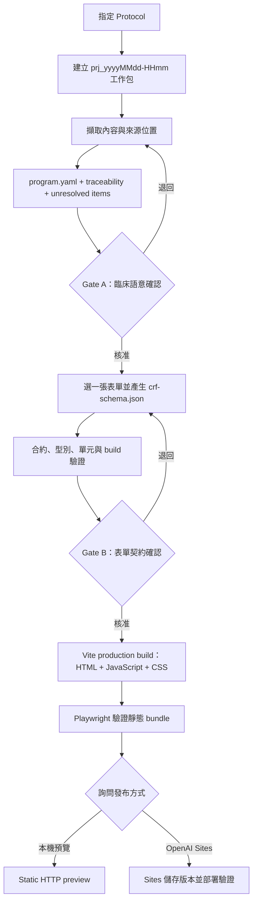

# Protocol to eCRF Skill：操作、審核與發布 SOP

> 本文件說明如何在 Codex 指定一份 Protocol，依序產生 `program.yaml`、AirwayAI eCRF JSON、預先編譯完成的 React HTML／JavaScript／CSS 靜態網站，並選擇性發布至 OpenAI Sites。所有產出一律是 **Demo 工程產物**，不可視為臨床核准、Production release 或 QMS validation 證據。

## 一、目前是否已能完成整條流程？

可以，但必須區分 AI 工作與確定性工具：

| 階段 | 執行者 | 目前能力 |
| --- | --- | --- |
| 指定 Protocol | 使用者／Codex | 支援本機或附件中的 PDF、DOCX、Markdown、TXT |
| 解析 Protocol | Codex Skill | 擷取候選表單、欄位、時程、條件與來源位置；不確定內容列入 unresolved item |
| 產生 `program.yaml` | Codex Skill | 建立可追溯的中介臨床規格，先停下等待人工確認 |
| 產生 `crf-schema.json` | Codex Skill | 只把已確認內容映射成 JSON Schema 與 `x-airwayai` UI 合約 |
| 合約與程式檢查 | npm／Vitest／AJV | 檢查 JSON Schema、AirwayAI meta-schema、語意規則、型別與 Renderer 行為 |
| React 靜態建置 | Vite | 在部署前將選定 schema 編譯成 HTML、JavaScript、CSS 與 assets |
| 瀏覽器驗收 | Playwright | 對 Chromium、Firefox、WebKit 執行 release smoke test |
| Sites 包裝 | release script／Sites | 產生 `site/`、manifest、checksums、驗證報告與 ZIP |
| OpenAI Sites 部署 | Sites | 使用通過 QA 的同一份靜態 bundle；共享或公開存取必須另行授權 |

這不是「瀏覽器上傳平台」。它是 Codex 內的受控開發流程：使用者指定 Protocol 後，Codex 讀取、分析、詢問、產檔並呼叫專案內的測試與建置工具。

## 二、Skill 安裝位置與啟動方式

Skill 已安裝在：

```text
C:\Users\ryan\.codex\skills\protocol-to-ecrf\
```

典型啟動提示：

```text
使用 $protocol-to-ecrf 處理
C:\Protocols\Study-ABC-Protocol-v2.1.pdf

Repository：
C:\Users\ryan\我的雲端硬碟\專案\Hackathon-ClinicalTrail
```

也可以把 Protocol 附加到 Codex，然後說：

```text
使用 $protocol-to-ecrf 處理我剛附加的 Protocol。
```

啟動前請確認：

- Node.js 24 與 npm 11 可用。
- `template/crf/node_modules/` 尚未安裝時，先在 `template/crf/` 執行 `npm ci`。
- Protocol 不含 PHI 或直接識別資訊。
- PDF 若是掃描影像，OCR 結果必須額外審查。

## 三、每次執行的獨立專案工作包

Skill 會執行：

```powershell
& 'C:\Users\ryan\.codex\skills\protocol-to-ecrf\scripts\new-project.ps1' `
  -RepositoryRoot 'C:\Users\ryan\我的雲端硬碟\專案\Hackathon-ClinicalTrail' `
  -ProtocolPath 'C:\Protocols\Study-ABC-Protocol-v2.1.pdf'
```

然後建立分鐘級時間戳目錄：

```text
2.SA/projects/
└─ prj_yyyyMMdd-HHmm/
   ├─ source/
   │  ├─ <原始 Protocol 檔案>
   │  └─ source-manifest.json
   ├─ analysis/
   │  ├─ program.yaml
   │  ├─ source-traceability.md
   │  └─ unresolved-items.md
   ├─ forms/
   │  └─ <formId>/<schemaVersion>/
   │     ├─ crf-schema.json
   │     └─ validation-report.md
   └─ releases/
      └─ <formId>/<schemaVersion>/
         ├─ site/
         ├─ web.config
         ├─ nginx.conf.example
         ├─ crf-schema.json
         ├─ program.yaml
         ├─ release-manifest.json
         ├─ release-validation-report.md
         ├─ DEPLOYMENT.md
         └─ <formId>-<schemaVersion>.zip
```

`source-manifest.json` 保存原檔名、大小、SHA-256 與複製時間，用來證明分析時使用哪一份來源。Skill 不修改原始 Protocol，也不覆寫已存在的 `prj_...`。

`2.SA/projects/` 已加入 `.gitignore`。原因是 Protocol 與分析結果可能包含機密試驗內容；只有明確確認為合成或已去識別的檔案，才可由使用者另外決定是否納入版本控制。

## 四、完整流程與兩道人工作業關卡



### 步驟 1：解析 Protocol

Codex 應擷取並追溯：

- Protocol 標題、版本與日期。
- 研究目的、endpoint、visit／timepoint 與 assessment。
- Protocol 中可辨識的候選表單。
- 每個欄位的資料型別、必填性、單位、範圍、選項、條件與計算。
- 來源章節、頁碼、表格或段落位置。
- 擷取方式是 native text、OCR 或 mixed。
- 信心為 high、medium 或 low；信心不等於核准。

不可從常識自行補上 Protocol 沒有明確支持的單位、範圍、選項、時間點或公式。

### 步驟 2：建立 `program.yaml`

`program.yaml` 是 Protocol 與 React JSON 之間的必要中介層。核心內容包括：

```yaml
contract_version: "1.0.0"
project_id: "prj_yyyyMMdd-HHmm"
source:
  file_name: "protocol.pdf"
  sha256: "..."
  protocol_title: "..."
  protocol_version: "..."
  extraction_method: "native-text"

candidate_forms:
  - candidate_id: "baseline-assessment"
    title: "Baseline assessment"
    source_refs:
      - locator: "Section 8.2, page 42"
        confidence: "high"

selected_form:
  candidate_id: "baseline-assessment"
  approval_status: "pending"
  fields: []

unresolved_items: []

approvals:
  clinical_meaning:
    status: "pending"
  form_contract:
    status: "pending"
```

完整欄位契約位於 Skill 的 `references/program-yaml-contract.md`。

### Gate A：確認臨床語意

Codex 一次只處理一張 eCRF。它會先列出候選表單，請使用者選擇，再呈現：

- 表單用途與所屬 visit。
- 欄位、型別、必填性、單位、範圍與選項。
- 顯示／啟用／動態必填條件。
- 計算欄位與來源欄位。
- 來源定位、信心與矛盾。
- 所有 unresolved items。

只要還有未解決且會影響資料契約的 `blocking` item，就不能產生正式 JSON。使用者確認後，才將 `approvals.clinical_meaning.status` 更新為 `approved`。

### 步驟 3：產生版本化 eCRF JSON

新 Demo 表單預設：

- `contractVersion: "1.0.0"`
- `schemaVersion: "0.1.0"`
- `status: "demo"`
- `defaultLocale: "zh-TW"`
- 顯示非正式臨床使用 disclaimer
- `additionalProperties: false`

輸出位置固定為：

```text
forms/<formId>/<schemaVersion>/crf-schema.json
```

Skill 只使用現有固定 widget 與 Predicate／computed AST。無法安全映射時會阻擋，不會為單一 Protocol 偷改共用 `FormRenderer`。

### 步驟 4：驗證目標 JSON

在 PowerShell 執行：

```powershell
Set-Location 'C:\Users\ryan\我的雲端硬碟\專案\Hackathon-ClinicalTrail\template\crf'

npm run validate:schema -- --schema '<crf-schema.json 絕對路徑>'
npm run check
npm test

$env:AIRWAYAI_CRF_SCHEMA_PATH = '<crf-schema.json 絕對路徑>'
npm run build
Remove-Item Env:\AIRWAYAI_CRF_SCHEMA_PATH
```

各指令意義：

| 指令 | 證明內容 |
| --- | --- |
| `validate:schema` | 指定 JSON 通過 Draft 2020-12、AirwayAI meta-schema 與語意編譯器 |
| `check` | TypeScript、合約與規則引擎核心測試通過 |
| `test` | Renderer 元件、active data、條件、計算、readonly 與無障礙測試通過 |
| `build` | library 與指定 schema 的 Demo 均能建置 |

測試通過只代表軟體契約與 Renderer 可執行，不代表臨床語意正確。

### Gate B：確認表單契約

Codex 必須呈現欄位清單、條件路徑、計算路徑、warning、active-data 行為與測試結果。使用者核准後，才將 `approvals.form_contract.status` 更新為 `approved`。

Release 工具會重新解析 `program.yaml`；Gate A 或 Gate B 任一不是 `approved`、仍有未解決 blocking item、或缺少追溯／驗證文件時，會拒絕打包。

## 五、本機預覽

若只要看畫面、不產生 release：

```powershell
Set-Location 'C:\Users\ryan\我的雲端硬碟\專案\Hackathon-ClinicalTrail\template\crf'
$env:AIRWAYAI_CRF_SCHEMA_PATH = '<crf-schema.json 絕對路徑>'
npm run dev
```

開啟終端機顯示的 `http://127.0.0.1:4173/`。結束時按 `Ctrl+C`，再執行：

```powershell
Remove-Item Env:\AIRWAYAI_CRF_SCHEMA_PATH
```

不可直接雙擊 `index.html`，因為 `file://` 無法提供 Vite／ES Module 所需的 HTTP origin。

## 六、建立 React 靜態部署包

Gate B 核准後一律先建立 production static bundle，再詢問是否發布至 OpenAI Sites。不得在 Sites backend、React SSR／RSC 或 HTTP request 階段轉譯 JSON。

使用 `template/crf/` 的 React／Vite 建置模式，輸出至少包含：

- `index.html`
- `assets/*.js`
- `assets/*.css`
- 其他 static assets
- `asset-manifest.json`
- `checksums.json`

執行：

```powershell
Set-Location 'C:\Users\ryan\我的雲端硬碟\專案\Hackathon-ClinicalTrail\template\crf'

npm run release -- `
  --schema '<crf-schema.json 絕對路徑>' `
  --project '<prj_yyyyMMdd-HHmm 絕對路徑>' `
  --target none `
  --mount-path '/'
```

Release 會重新執行：

- 目標 schema 合約驗證。
- TypeScript 與規則引擎檢查。
- 全部 Vitest／React Testing Library 測試。
- 可匯入 library build。
- 指定 schema 靜態 build。
- Chromium、Firefox、WebKit release smoke test。

任一步驟失敗都不會建立正式 release 目錄。

## 七、部署到 OpenAI Sites

1. 先以 `sites-building` 驗證 React production build 與 Sites integration。
2. 確認 `.openai/hosting.json`，重用既有 `project_id`，不得建立重複 Sites project。
3. 將通過 Playwright QA 的同一份 `site/` 連同 manifest 與 checksums 封裝成 Sites version。
4. 使用 `sites-hosting` 儲存版本並部署；預設使用 private access。
5. 若只能共享或公開，先取得使用者明確核准。
6. Sites 回報成功後，驗證 published URL、版本識別及 HTML／JavaScript／CSS assets。
7. 確認部署 bundle 的 checksum 與 QA evidence 完全一致。

此 Demo 沒有後端 API、登入、資料庫、audit trail 或正式安全邊界；不得直接當成正式臨床收案系統。

## 八、前後端責任邊界

- JSON-to-HTML、schema-to-component mapping、JSX／TypeScript 轉譯與 CSS 打包必須在 build 階段完成。
- Sites Worker 只能提供 static assets 或非渲染 API，不得在 request time 產生表單 HTML。
- 若未來加入登入、核准、CDASH 查詢或 persistence，API 只處理該項責任，不得接管 React form rendering。
- QA 必須從 static HTTP origin 測試 production bundle，不得只驗證 Vite dev server 或 SSR response。

## 九、版本、不覆寫與 Protocol amendment

- `prj_yyyyMMdd-HHmm` 是一次分析工作包，不覆寫舊專案。
- `<formId>/<schemaVersion>` 是不可變表單快照。
- Release 已存在時打包工具會停止，不會覆寫。
- 破壞欄位契約升 major；新增選填欄位升 minor；純文案修正升 patch。
- Protocol amendment 應建立新 `prj_...`，保留新來源 SHA-256，重新經過 Gate A 與 Gate B。

## 十、Fail-closed 情境

遇到下列情況，Skill 或 release 工具必須停止：

- Protocol 含疑似 PHI 或直接識別資訊。
- OCR 造成關鍵臨床敘述無法確認。
- Protocol 章節互相矛盾。
- 欄位單位、範圍、選項、時程、必填性或計算規則不明。
- 找不到可靠來源位置。
- 欄位無法映射到現有安全 widget。
- JSON 路徑懸空、型別不相容、ID 重複或計算循環。
- Gate A／Gate B 未核准。
- 任何自動測試、build 或三瀏覽器 smoke test 失敗。
- 同一版本的 release 已存在。

## 十一、交付檢查表

- [ ] Protocol 已複製到獨立 `prj_.../source/`，SHA-256 manifest 已產生。
- [ ] `program.yaml` 每個重要概念都有來源定位。
- [ ] 所有 blocking unresolved item 已解決。
- [ ] 使用者已選擇一張表單並通過 Gate A。
- [ ] JSON 是 Demo 狀態、版本化且未覆寫舊版。
- [ ] `validate:schema`、`check`、`test`、`build` 通過。
- [ ] 使用者已檢閱欄位、條件、計算與 active data，通過 Gate B。
- [ ] React production build 已產生 HTML、JavaScript、CSS、assets、manifest 與 checksums。
- [ ] QA 測試的是準備部署的同一份 static bundle，且確認不依賴 request-time rendering。
- [ ] Skill 已詢問是否發布至 OpenAI Sites；非 private access 已取得明確核准。
- [ ] Release manifest、Sites version、驗證報告與 ZIP 已產生。
- [ ] 只有 `site/` 靜態產物進入 Sites，Protocol 不進公開網站。
