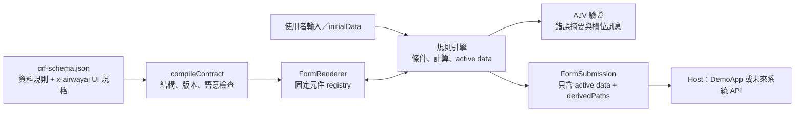

# React JSON-Driven eCRF Renderer：測試與架構指南

> 適用範圍：`template/crf/` 的 React／Vite 展示程式，以及 `template/data-dictionaries/` 的 AirwayAI 合成 eCRF 合約。本專案是可展示、可測試的工程基線，**不可用於正式臨床資料蒐集或宣稱已完成 QMS validation**。

若要從 Protocol 開始，經人工確認後產生 JSON、React 靜態網站與 IIS／NGINX 部署包，請見 [Protocol to eCRF Skill 操作與發布 SOP](./Protocol_to_eCRF_Skill_操作與發布SOP.md)。

## 先解決：為什麼直接開 `index.html` 會出現 CORS 錯誤？

這不是後端 API 的 CORS 設定問題。以檔案總管雙擊 `template/crf/index.html` 時，瀏覽器會用 `file:///.../index.html` 開啟它；但此專案使用 ES Modules、TypeScript／JSX 轉換與 JSON 載入，這些工作必須交給 Vite 本機伺服器處理。`file://` 沒有正確的 HTTP origin 與 Vite 模組轉換，因此會被瀏覽器的同源政策阻擋。

不要直接開啟 `index.html`，也不需要停用瀏覽器安全性。請以下列方式啟動。

## 一、如何啟動與手動測試

### 第一次安裝與啟動

請在 PowerShell 執行：

```powershell
Set-Location 'C:\Users\ryan\我的雲端硬碟\專案\Hackathon-ClinicalTrail\template\crf'
npm ci
npm run dev
```

- `npm ci` 依 `package-lock.json` 安裝完全相同版本的套件；第一次使用或套件異常時使用即可。它會重建 `node_modules`。
- `npm run dev` 啟動 Vite 開發伺服器。終端機會列出網址，預設為 `http://127.0.0.1:4173/`；以該網址開啟瀏覽器。
- 要停止伺服器時，在該終端機按 `Ctrl+C`。

若預設連接埠已被其他程式占用，可改用：

```powershell
npm run dev -- --port 4174
```

接著開啟終端機顯示的網址，例如 `http://127.0.0.1:4174/`。

### 用接近正式產物的方式預覽

```powershell
npm run build
npm run preview
```

`build` 先做型別／邏輯檢查，再產生可重用 library 與 Demo 靜態檔；`preview` 仍會以本機 HTTP server 提供頁面，所以同樣不能雙擊 `dist-demo/index.html`。

### 建議的手動驗收流程

Demo 使用合成資料，請勿輸入 PHI 或真實病人資料。

| 操作 | 預期結果 | 驗證的能力 |
| --- | --- | --- |
| 不填必填欄位，直接按「提交」 | 顯示錯誤摘要並將焦點移到第一個錯誤 | submit 驗證與無障礙焦點管理 |
| 選擇「已有睡眠檢查」 | AHI 與單位欄位出現並成為必填 | `visibleWhen`、`requiredWhen` |
| 再改選「尚未檢查」 | AHI 欄位隱藏，原先輸入值留在本次 session，但不送出 | active-data 投影 |
| 症狀選「其他」 | 「其他症狀說明」欄位出現 | 條件跳欄 |
| 填完 ESS 八題 | ESS 總分自動計算；任一題缺值時顯示未完成 | 唯讀 `sum` 計算 AST |
| 啟用 CBCT 座標並填 x、y、z、unit | 表單送出 `{ x, y, z, unit }` 型別資料 | `coordinate_3d` 元件 |
| 勾選 Demo 的「下次送出模擬失敗」再提交 | 顯示安全的失敗訊息，資料不被清空 | 非同步提交失敗處理 |
| 切換 readonly 模式 | 以不可編輯方式顯示既有資料；可辨識但不合規的舊值會警告，不自動改寫 | 病歷回看模式 |

Demo 右側的 payload、診斷資訊是開發展示區，目的是協助 SA／工程人員檢查資料流；正式臨床操作畫面不應直接呈現技術錯誤。

## 二、自動測試指令

以下命令都要在 `template/crf/` 執行。

| 指令 | 用途 |
| --- | --- |
| `npm run check` | TypeScript 檢查，加上合約編譯與規則引擎核心測試 |
| `npm test` | 執行全部 Vitest／React Testing Library 測試 |
| `npm run test:watch` | 開發時持續監看並重跑 Vitest |
| `npm run test:e2e -- --workers=1 --reporter=line` | 在 Chromium、Firefox、WebKit 跑 Playwright 端對端流程 |
| `npm run build` | 驗證後同時建置 library（`dist/`）與 Demo（`dist-demo/`） |

Playwright 第一次執行可能需要下載三個瀏覽器，時間會較長。產物資料夾 `dist/`、`dist-demo/`、`node_modules/` 和 `output/` 都是可重建檔案，已排除在版本控制之外。

## 三、整體資料流：React、JSON 與表單如何合作



流程重點：

1. SA 先在 JSON 定義資料型別、必填、選項及受控 UI 版面；不在 JSON 寫任意 JavaScript 或 CSS。
2. `compileContract` 先用 JSON Schema Draft 2020-12 驗證資料結構，再以 AirwayAI meta-schema 與語意規則檢查版本、路徑、重複 ID、型別及循環相依。無法安全解讀的合約會 fail-closed，整張表不渲染。
3. `FormRenderer` 依欄位 widget 和 layout AST 選擇固定 React 元件，並處理輸入狀態、可見性、啟用狀態、計算值與驗證。
4. 送出時只建立 **active data**：隱藏或條件停用欄位的值雖保留於目前編輯 session，卻不驗證、也不送出；計算欄位會送出並列在 `derivedPaths`，後端仍必須重算。

## 四、資料夾與檔案導覽

```text
Hackathon-ClinicalTrail/
├─ 2.SA/DOCS/
│  ├─ 系統開發規格書.md                 # SA 的需求／規格主文件
│  └─ React_eCRF_Renderer_測試與架構指南.md # 本文件：執行、測試、程式架構
├─ template/
│  ├─ data-dictionaries/                # 表單合約與作者規範
│  │  ├─ crf-contract.meta-schema.json
│  │  ├─ crf-schema.json
│  │  └─ README.md
│  └─ crf/                              # 可重用 React library 與可執行 Demo
│     ├─ src/
│     ├─ e2e/
│     ├─ scripts/                       # schema 驗證與三階段 release 工具
│     ├─ package.json
│     ├─ index.html
│     ├─ vite.config.ts
│     ├─ vite.lib.config.ts
│     ├─ vitest.config.ts
│     └─ playwright.config.ts
└─ agent-SA.md                           # SA Agent 工作規範與資料契約原則
```

### `template/data-dictionaries/`：SA 可以優先閱讀與維護的地方

| 檔案 | 作用 |
| --- | --- |
| `crf-schema.json` | 「AirwayAI 基線評估」的合成範例。標準 JSON Schema 管資料，根層 `x-airwayai` 管欄位標籤、版面、條件與計算。它是 Demo 的表單來源。 |
| `crf-contract.meta-schema.json` | 定義 `x-airwayai` 擴充欄位可以長什麼樣子，例如 widget、predicate AST、layout AST。這是「規格的規格」。 |
| `README.md` | 給 JSON 樣板作者的指南：欄位型別、版本、JSON Pointer、條件與計算寫法。 |

資料層與介面層刻意分開：`properties`／`required`／`enum` 等標準 JSON Schema 是資料契約；`x-airwayai.fields` 與 `layout` 是可安全編譯的介面描述。這讓同一份資料契約未來可被不同前端或後端驗證器共用。

### `template/crf/src/`：React 程式的主要結構

| 檔案／資料夾 | React 架構中的角色 |
| --- | --- |
| `demo/main.tsx` | React 的進入點。用 `createRoot(...)` 將應用程式掛到 `index.html` 的 `#root` 容器。 |
| `demo/DemoApp.tsx` | Demo 的 Host application。負責切 edit／readonly、模擬送出、展示 payload／診斷；正式系統日後以自己的頁面取代它。 |
| `FormRenderer.tsx` | 可重用的核心 React 元件。接收 `schema`、資料、模式與 callback，產生語意化 HTML 表單。固定支援 text、textarea、數值、日期、radio、select、checkbox group、boolean、computed、`coordinate_3d`。 |
| `FormRenderer.module.css` | 核心元件的 CSS Module。使用 CSS variables，避免全域樣式互相干擾。 |
| `contract.ts` | 合約編譯器。驗證 JSON Schema、AirwayAI meta-schema 和語意規則，產生已解析的 contract。 |
| `engine.ts` | 純規則引擎。計算 predicate、可見／可用／必填狀態、computed 欄位、active data 與 AJV 錯誤轉譯；不依賴畫面，容易單獨測試。 |
| `pointer.ts` | RFC 6901 JSON Pointer 的讀寫工具，讓 `/sleepStudy/ahi` 等路徑可安全對應 JSON 中的值。 |
| `types.ts` | TypeScript 型別：`CrfContract`、Predicate、Field、Diagnostic、`FormSubmission` 等共用契約。 |
| `index.ts` | library 對外唯一入口；正式 Host 應從此匯入 `FormRenderer` 與公開型別。 |
| `vite-env.d.ts` | 宣告建置時注入的 `@airwayai/active-crf-schema` 模組，讓同一個 Demo 可編譯不同版本化 JSON。 |
| `schema-file.test.ts` | 接收 `AIRWAYAI_CRF_SCHEMA_PATH`，對指定外部 JSON 執行完整合約編譯器。 |
| `*.test.ts`、`*.test.tsx` | Vitest 單元／元件測試：合約、規則引擎、欄位顯示與送出行為。 |

### `template/crf/` 的設定與建置檔

| 檔案 | 作用 |
| --- | --- |
| `package.json` | npm scripts 與套件清單；先看這裡了解能執行哪些測試。 |
| `package-lock.json` | 鎖定 Node 24／npm 11 下實際安裝的套件版本，團隊應一併提交。 |
| `index.html` | Vite 的 HTML 外殼與 `#root` 掛載點；它不是獨立可雙擊執行的網頁。 |
| `vite.config.ts` | Demo 開發／預覽、可變 schema alias 與可攜式靜態入口設定；建置後將入口資源改為 `./assets/...`。 |
| `vite.lib.config.ts` | 將 `src/index.ts` 打包成可被其他 React 專案匯入的 library。 |
| `vitest.config.ts` | 單元及元件測試環境設定。 |
| `playwright.config.ts`、`e2e/demo.spec.ts` | 三個瀏覽器的端對端測試設定與既有 Demo 使用者流程。 |
| `e2e/release.spec.ts` | 僅在 release pipeline 啟用，確認指定版本 schema 的靜態網站可在三個瀏覽器渲染。 |
| `scripts/validate-schema.mjs` | `npm run validate:schema` CLI；把指定 JSON 交給 Vitest 中的正式合約編譯器。 |
| `scripts/release.ps1` | `npm run release` 的 Windows orchestrator；依序執行 prepare、三瀏覽器 smoke 與 finalize。 |
| `scripts/build-release.mjs` | 檢查兩道核准、unresolved item、路徑與版本，完成測試／建置後只建立 staging state。 |
| `scripts/finalize-release.mjs` | 驗證 smoke nonce 證據後才產生 server config、manifest、報告、ZIP 與不可變 release。 |
| `tsconfig.json`、`tsconfig.build.json` | TypeScript 的開發與 library 宣告檔建置設定。 |

## 五、用 React 的觀點理解這個專案

### 1. `index.html` 只提供掛載位置

React 不會把整個畫面寫在 HTML 中。`index.html` 只有根節點 `<div id="root">`，Vite 載入 `demo/main.tsx` 後，React 才把元件樹繪製到這個節點。因此它必須由 Vite 提供，不可單獨開啟。

### 2. `DemoApp` 是 Host，`FormRenderer` 是可嵌入的元件

`DemoApp` 示範外部系統應如何使用 renderer：提供合約、初始資料、模式及 callback；renderer 不知道也不應知道 API 位址、病人身分或資料庫。

```tsx
<FormRenderer
  schema={schema}
  initialData={record.data}
  mode="edit"
  onChange={(snapshot) => setPreview(snapshot.activeData)}
  onSubmit={async (submission) => {
    // 未來由 Host 呼叫自己的安全 API；本範例沒有後端。
    await saveToYourApi(submission);
  }}
/>
```

送出 callback 收到的資料格式如下：

```ts
{
  formId: "airwayai-baseline-assessment",
  schemaVersion: "1.0.0",
  contractVersion: "1.0.0",
  locale: "zh-TW",
  data: { /* 僅目前 active 的欄位 */ },
  derivedPaths: ["/ess/total"]
}
```

這個切分就是 React 常見的「資料由上而下傳入（props）、事件由下而上回傳（callbacks）」：Host 擁有業務流程，`FormRenderer` 專心把可信的 JSON 合約轉成表單。

### 3. 畫面狀態與送出資料不是同一份

使用者先填 AHI 再選「尚未檢查」時，AHI 值仍保留在記憶體，方便使用者改回選項時不必重填；但條件規則把它標為 inactive，送出資料不會含它。這可避免舊值意外送到後端，也解釋了為何 Demo 的「目前 active payload」可能比畫面曾經填過的欄位少。

### 4. 為什麼規則放在 `engine.ts` 而不是元件內？

條件、計算和資料投影是領域規則，不是視覺呈現。把它們寫成純函式可直接用 Vitest 驗證，也能讓未來其他介面（例如不同 React 頁面）共用同一套規則；`FormRenderer.tsx` 則保留為較薄的 UI 組裝層。

## 六、修改時的建議順序

1. 先閱讀並複製 `template/data-dictionaries/crf-schema.json`，只使用 `README.md` 已說明的欄位與運算子。
2. 每次改 JSON 後跑 `npm run check`，先排除不合規、懸空路徑或循環相依。
3. 用 `npm run dev` 手動確認文案、條件跳欄及 layout。
4. 新增規則時，在 `src/engine.test.ts` 或 `src/contract.test.ts` 補測試；新增 UI 行為時，在 `src/FormRenderer.test.tsx` 補測試。
5. 交付前跑 `npm test`、`npm run test:e2e -- --workers=1 --reporter=line` 和 `npm run build`。

## 七、常見問題

| 現象 | 原因與處理 |
| --- | --- |
| 雙擊 `index.html` 後看到 CORS、MIME 或 module 載入錯誤 | 改用 `npm run dev` 或 `npm run preview`，以終端機顯示的 `http://127.0.0.1:...` 網址開啟。 |
| `npm` 不是可辨識的命令 | 安裝或重新開啟 Node.js 24（含 npm 11）後的 PowerShell，再執行指令。 |
| 畫面空白或 JSON 改完不能顯示 | 查看執行 `npm run dev` 的終端機訊息，並先執行 `npm run check`；結構性合約錯誤會依 fail-closed 原則停止渲染。 |
| 3D 欄位 metadata 不完整 | Renderer 會改顯示 x、y、z 三個型別相容的基本數值輸入，並回報 diagnostic warning；不會退化為任意文字輸入。 |
| 想把 Demo 接上後端 | 此首版沒有 API。由 Host 的 `onSubmit` 接收 `FormSubmission` 後呼叫自己的 API；伺服器端必須再次驗證原始資料並重算 `derivedPaths`。 |
